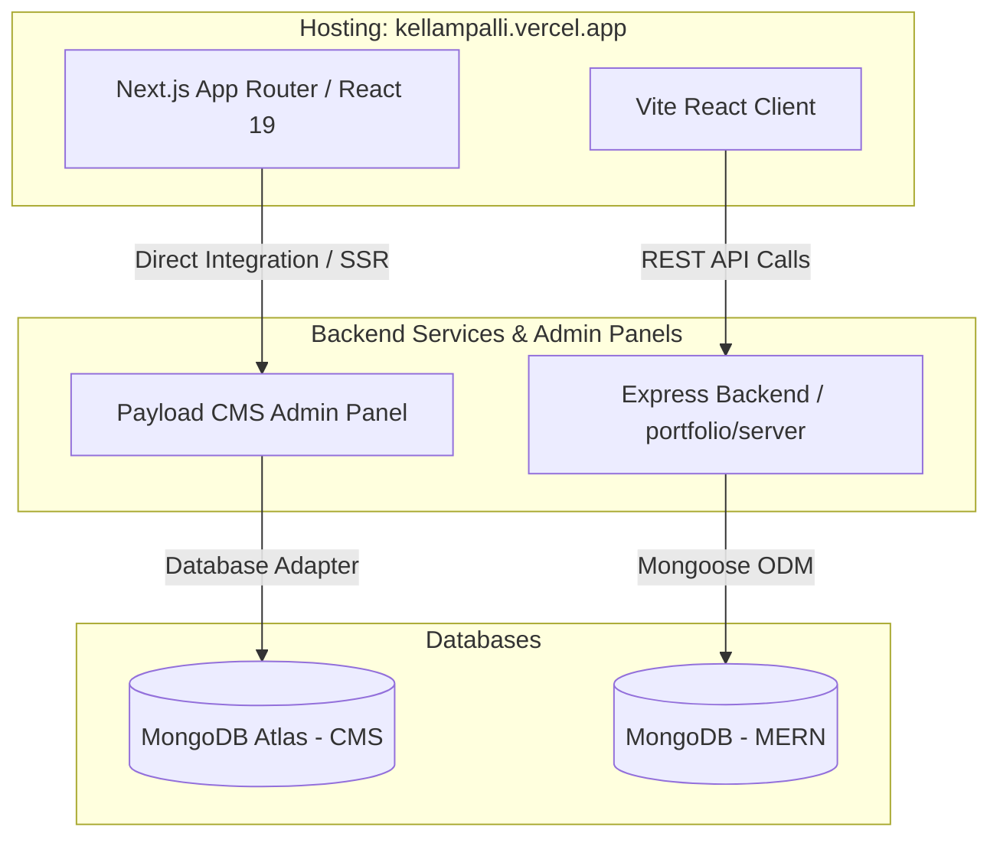
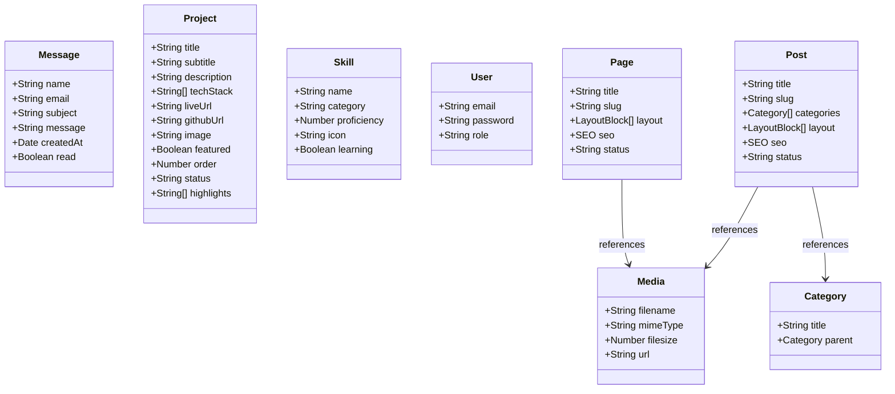

# 🌟 Kellampalli Portfolio & CMS Workspace

Welcome to the central repository for the Kellampalli portfolio and website space. This workspace contains two core applications: a customizable **MERN-stack Portfolio** and a premium **Next.js & Payload CMS-powered Website/Blog platform**.

🔗 **Live Deployment:** [kellampalli.vercel.app](https://kellampalli.vercel.app)

---

## 📂 Root Folder Structure

The project is organized as a workspace separating the custom React-Express MERN portfolio from the Payload CMS platform.

```directory
Portfolio-2/
├── portfolio/                 # Custom MERN Stack Portfolio
│   ├── client/                # React Vite Frontend
│   │   ├── src/               # React components, pages, routes, assets
│   │   ├── index.html         # Application entrypoint
│   │   ├── tailwind.config.js # Styling configurations
│   │   └── package.json       # Frontend dependencies
│   └── server/                # Node.js + Express + Mongoose Backend
│       ├── config/            # DB configuration & connections
│       ├── models/            # MongoDB schema definitions
│       ├── routes/            # Express router mapping routes to controllers
│       ├── seed/              # Database seeding scripts
│       └── server.js          # Entrypoint of the backend server
├── portoflio/                 # Premium Next.js & Payload CMS Platform (with typo)
│   ├── public/                # Public assets, icons, fonts
│   ├── src/                   # Next.js App Router & CMS Code
│   │   ├── app/               # App Router pages, APIs, layouts
│   │   ├── collections/       # Payload CMS Collection Schemas (Pages, Posts, Users)
│   │   ├── components/        # Shared Shadcn UI & custom React components
│   │   └── payload.config.ts  # Centralized Payload CMS setup
│   ├── tsconfig.json          # TypeScript configurations
│   └── package.json           # CMS platform dependencies
└── README.md                  # Workspace documentation (this file)
```

---

## 🛠️ Technology Stack

### 1. Custom MERN Portfolio (`portfolio/`)
Built as a decoupled single-page application with a dedicated API layer:

*   **Frontend Client (`portfolio/client`):**
    *   **React 18 & Vite:** Lightning-fast HMR and building pipeline.
    *   **React Router Dom (v7):** Modern declarative client-side routing.
    *   **Tailwind CSS (v3):** Utility-first styling for speed and flexibility.
    *   **Framer Motion:** High-fidelity animations and micro-transitions.
    *   **Axios:** Promise-based HTTP client for API consumption.
*   **Backend Server (`portfolio/server`):**
    *   **Node.js & Express:** Lightweight routing and middleware server.
    *   **Mongoose & MongoDB:** Document database ODM schema modeling.
    *   **CORS & Dotenv:** Cross-Origin Resource Sharing handling and environment management.

### 2. CMS Platform (`portoflio/`)
A state-of-the-art server-rendered system combining a headless CMS and site:

*   **Framework:** **Next.js 16 (App Router)** & **React 19**
*   **Headless CMS:** **Payload CMS 3.x**
*   **Database:** MongoDB via **@payloadcms/db-mongodb** adapter.
*   **Styling & UI:** **Tailwind CSS v4** + **Shadcn/UI** (built on Radix Primitives).
*   **Forms:** React Hook Form for client/admin interactions.
*   **Plugins:** Payload Search, SEO, Redirects, and Nested Docs plugins.

---

## 📊 UML Diagrams

### 1. System Architecture Diagram
This component diagram shows how frontend clients communicate with databases and backends across the deployed systems.



### 2. Database Schema Class UML
Describes the structured data schema for the MERN applications (Message, Project, Skill) and the main collections configured within Payload CMS.



---

## 🚀 Running Locally

### Prerequisites
*   Node.js (v18.20.2 or higher, v20+ recommended)
*   MongoDB Instance (Local running MongoDB daemon or MongoDB Atlas URL)
*   `pnpm` or `npm` package manager installed globally

---

### Step 1: Starting the MERN Portfolio (`portfolio/`)

#### 💻 Backend Setup
1. Navigate to the server folder:
   ```bash
   cd portfolio/server
   ```
2. Copy configuration environment variables:
   ```bash
   cp .env.example .env
   ```
3. Open `.env` and supply your database connection string and port:
   ```env
   PORT=5000
   MONGO_URI=your_mongodb_connection_string
   CLIENT_URL=http://localhost:5173
   ```
4. Install dependencies:
   ```bash
   npm install
   ```
5. Seed database mock projects/skills:
   ```bash
   npm run seed
   ```
6. Start dev server:
   ```bash
   npm run dev
   ```

#### 🖥️ Frontend Setup
1. Navigate to the client folder:
   ```bash
   cd portfolio/client
   ```
2. Install dependencies:
   ```bash
   npm install
   ```
3. Start development server:
   ```bash
   npm run dev
   ```

---

### Step 2: Starting the Next.js + Payload CMS (`portoflio/`)

1. Navigate to the CMS directory:
   ```bash
   cd portoflio
   ```
2. Copy environment variables:
   ```bash
   cp .env.example .env
   ```
3. Update `.env` with your Mongo URI configuration.
4. Install dependencies:
   ```bash
   pnpm install
   ```
5. Run development server:
   ```bash
   pnpm dev
   ```
6. Open admin dashboard at [http://localhost:3000/admin](http://localhost:3000/admin) to manage collections and content pages.
