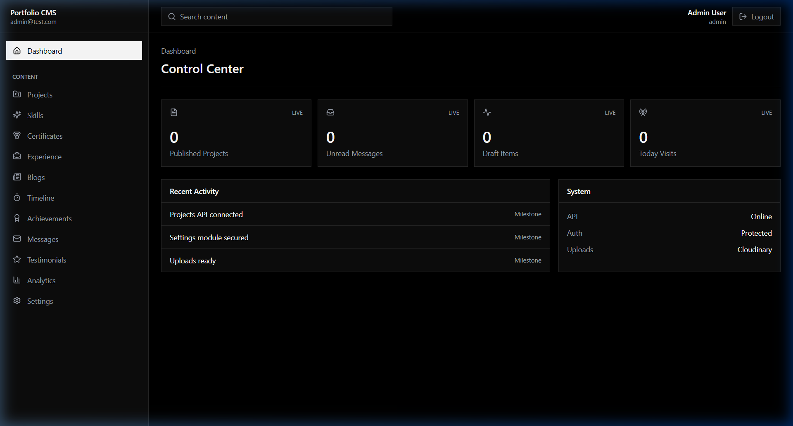
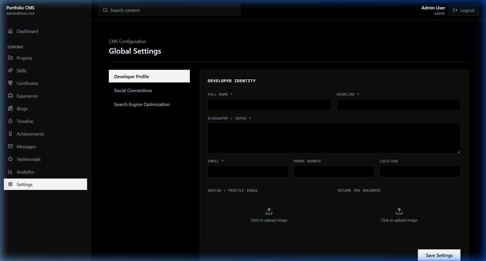
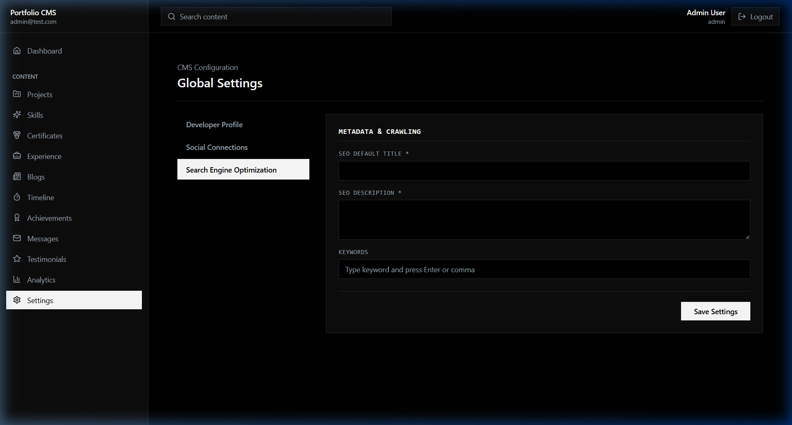
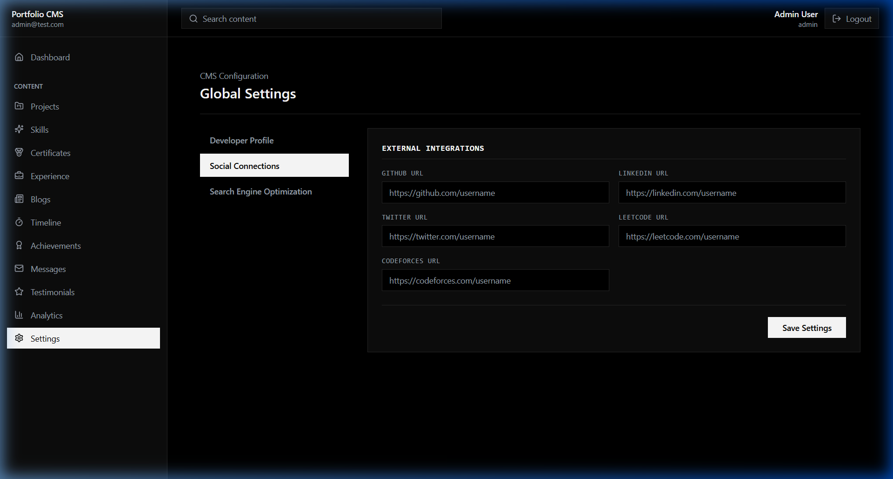
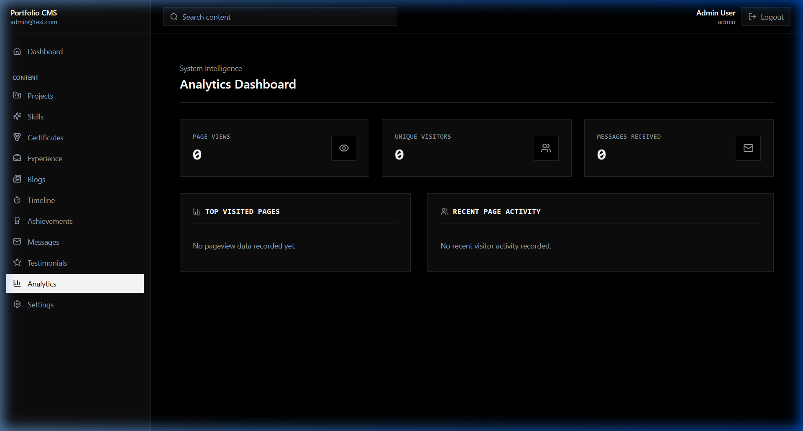

# 🛡️ MERN Stack Portfolio-CMS Ecosystem

[](https://turbo.build/)
[](https://pnpm.io/)
[](https://expressjs.com/)
[](https://tanstack.com/query)
[](https://vitest.dev/)

An enterprise-grade, high-performance personal portfolio and Content Management System (CMS) built as a **MERN Monorepo** using **pnpm workspaces** and **Turborepo**. The ecosystem integrates a public client-facing React website, a private administrative control dashboard, and a secure, production-hardened Express REST API.

---

## 🏗️ Architectural Overview

The repository leverages a unified workspace layout to share dependencies, avoid version drift, and coordinate task runs (development, linting, testing, and production builds) with caching.

```txt
Portfolio-2/
├── apps/
│   ├── portfolio/         # Public React + Vite portfolio website (Preemptive cold-start wakeup pings)
│   └── dashboard/         # Private Admin CMS Dashboard (React + Vite + React Query + Zustand)
├── server/                # Express + MongoDB API backend (Generic CRUD architecture & Zod validations)
├── packages/              # Shared infrastructure modules
│   ├── shared/            # Shared validators, constants, and schema schemas
│   ├── api-client/        # Shared API fetch client configurations
│   └── ui/                # Shared UI design system primitives
├── assets/                # Media assets, screenshots, and visual walkthroughs
├── package.json           # Root workspace script orchestrations
├── pnpm-workspace.yaml   # pnpm workspace configuration
└── turbo.json             # Turborepo task runner caching configurations
```

---

## 🛠️ CMS Ecosystem Features & Modules

The platform implements a complete, modular, and dynamic **CMS architecture** with full CRUD capabilities across **11 content modules**:

| Module | Type | Supported Operations | Backend Endpoint | Features |
| :--- | :--- | :--- | :--- | :--- |
| **Projects** | Public/Admin | `GET`, `POST`, `PUT`, `DELETE` (Soft), `RESTORE` | `/api/projects` | Rich media attachments (Cloudinary), tags, tech stack lists, featured toggle |
| **Skills** | Public/Admin | `GET` (Grouped), `POST`, `PUT`, `DELETE`, `RESTORE` | `/api/skills` | Legacy grouped array layout fallback, sorting, proficiency percentages, categorization |
| **Certificates** | Public/Admin | `GET`, `POST`, `PUT`, `DELETE`, `RESTORE` | `/api/certificates` | Verification credentials, validation dates, issuer logos, Cloudinary image upload |
| **Experience** | Public/Admin | `GET`, `POST`, `PUT`, `DELETE`, `RESTORE` | `/api/experience` | Timeline placement, description arrays, company mapping |
| **Blogs** | Public/Admin | `GET`, `POST`, `PUT`, `DELETE`, `RESTORE` | `/api/blogs` | Rich text article markdown support, cover image upload, read time metrics |
| **Timeline** | Public/Admin | `GET`, `POST`, `PUT`, `DELETE`, `RESTORE` | `/api/timeline` | Career history markers, educational highlights, sorting order index |
| **Achievements** | Public/Admin | `GET`, `POST`, `PUT`, `DELETE`, `RESTORE` | `/api/achievements` | Performance metrics, honors, award verification links |
| **Testimonials** | Public/Admin | `GET`, `POST`, `PUT`, `DELETE`, `RESTORE` | `/api/testimonials` | Clients/collaborators review, client company logo, rating |
| **Settings** | Public/Admin | `GET`, `PUT` | `/api/settings` | Singleton database representation, multi-tab settings panel (SEO, Profile, Socials) |
| **Messages** | Admin Only | `GET`, `DELETE` (Soft/Hard), `PUT` (Read status) | `/api/contact` | Public contact submission, read/unread status tracker, notification summary |
| **Analytics** | Admin Only | `GET` | `/api/analytics` | Summary panels featuring aggregated document counts across all database collections |

---

## 🔒 Enterprise-Grade Security & Performance

### 🔑 Robust Authentication & JWT Rotation
* **Two-Token System**: Employs short-lived JWT Access Tokens passed via memory headers and long-lived Refresh Tokens stored in secure, signed, **`HttpOnly`**, and **`SameSite=None`** (cross-origin compatibility) cookies.
* **Unauthorized Loop Mitigation**: Custom Axios interceptor checks requests to prevent infinite session restoration/refresh preflight loops on failure.
* **Auth Companion Token (`hasRefreshToken`)**: Set on successful login, this client-accessible cookie allows the dashboard to bypass unnecessary server calls (and subsequent 401 spams) on initial load when no session is active.

### 🛡️ Production Hardening
* **Security Headers**: Standardized response headers are injected via `Helmet` to block script-injection and framing vulnerabilities (XSS, Clickjacking).
* **Rate Limiting**: Protected by global API rate limiters (`express-rate-limit`) with custom, optimized exclusions for authentication token refreshes and public client message posts.
* **Database Isolation**: The backend separates local development runs from automated testing runs. Test executions target a dedicated `portfolio-test` database, completely eliminating the risk of data loss.

### ⚡ Render Cold-Start Pre-Warming
* Free-tier backend deployments on **Render** sleep automatically after periods of inactivity.
* To prevent front-end lag when sending messages, the Portfolio frontend calls `wakeupBackend()` in a non-blocking context when the root application mounts.
* Pings are fired in parallel using `Promise.allSettled` to both the local/configured API and the production Render backend `https://portfolio-57o9.onrender.com/api/health`.

---

## 🖼️ Interface & Dashboard Preview

The Admin Dashboard is built with a premium, responsive dark luxury design system, leveraging custom tables, dynamic form schemas, glassmorphic filters, and interactive panels.

````carousel

<!-- slide -->

<!-- slide -->

<!-- slide -->

<!-- slide -->

````

---

## ⚙️ Environment Variables Reference

### 1. Backend Server (`server/`)
Create a `.env` file under `server/` or configure the service settings in production (Render):

```ini
PORT=5000
MONGODB_URI=mongodb://127.0.0.1:27017/portfolio
JWT_ACCESS_SECRET=your_jwt_access_secret_here
JWT_REFRESH_SECRET=your_jwt_refresh_secret_here
COOKIE_SECRET=your_cookie_secret_here
JWT_ACCESS_EXPIRES=15m
JWT_REFRESH_EXPIRES=7d
BCRYPT_ROUNDS=12
FRONTEND_URL=http://localhost:5173
ADMIN_URL=http://localhost:5174
CLOUDINARY_CLOUD_NAME=your_cloudinary_cloud_name
CLOUDINARY_API_KEY=your_cloudinary_api_key
CLOUDINARY_API_SECRET=your_cloudinary_api_secret
```

### 2. Frontend Apps (`apps/portfolio/` & `apps/dashboard/`)
Configure client environment files (`.env.local`) or configure Vercel settings:

* **Portfolio Client**: `VITE_API_URL` defaults to `https://portfolio-57o9.onrender.com/api` in production (or `/api` in development for local proxying).
* **Dashboard Client**: `VITE_API_URL` defaults to `http://localhost:5000/api` (or custom staging/production API endpoint).

---

## 🚀 Running Locally

### 1. Initial Setup
From the repository root, install dependencies across all workspace modules:
```bash
pnpm install
```

### 2. Database Seeding
To register the default admin login credentials (`admin@test.com` / `StrongAdminPassword@1`), seed the database:
```bash
pnpm seed
```

### 3. Spin Up Development Stack
Launch all applications simultaneously (Backend, Dashboard, Portfolio) with Turborepo task caching:
```bash
pnpm dev
```
* **Frontend Portfolio**: `http://localhost:5173`
* **Admin Dashboard**: `http://localhost:5174`
* **Backend API**: `http://localhost:5000`

---

## 🧪 Testing & Code Quality

The codebase enforces strict linting, styling guidelines, and automatic test suites across all core components:

* **Execute Server-side Tests**:
  ```bash
  pnpm --filter @portfolio/server test
  ```
* **Execute Portfolio Tests**:
  ```bash
  pnpm --filter @portfolio/portfolio test
  ```
* **Format Project Files**:
  ```bash
  pnpm format
  ```
* **Lint Monorepo Codebase**:
  ```bash
  pnpm lint
  ```

---

## 🌐 Production Deployment & CORS Guidelines

When deploying MERN stacks across separate environments (e.g. Vercel for frontends and Render for backends), strict SameSite Cookie standards must be maintained.

### 🛡️ SameSite Cookie Policies
* The backend sets access/refresh cookies using `SameSite: 'none'` and `Secure: true`. This allows browsers to accept cross-origin cookies safely over HTTPS.
* An authorization helper cookie (`hasRefreshToken=true`) is exposed to Javascript so the frontend can check local authentication status and restore user sessions instantly on page load.

### 🔀 Recommended: Vercel Rewrite Proxy
Using Vercel rewrites acts as a reverse proxy, bypassing CORS policies entirely and securing cookie transmission:

1. Update the `vercel.json` file in your client app (e.g. `apps/portfolio/vercel.json`):
   ```json
   {
     "rewrites": [
       { "source": "/api/:path*", "destination": "https://portfolio-57o9.onrender.com/api/:path*" },
       { "source": "/(.*)", "destination": "/index.html" }
     ]
   }
   ```
2. The client will send requests to `/api/contact` on its own origin, which Vercel proxies securely to Render in the background. No CORS errors will be encountered.
