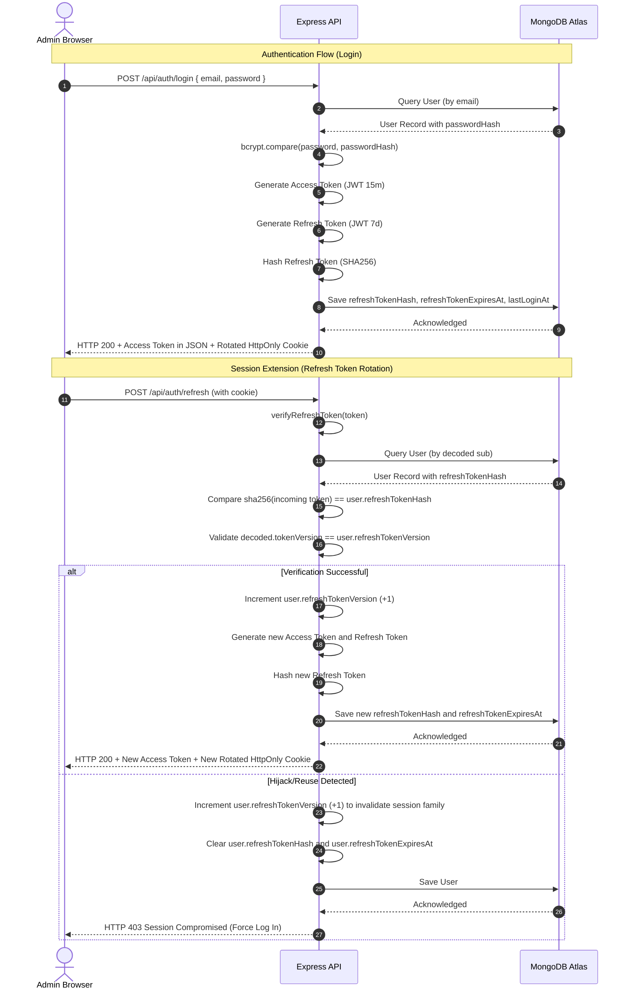
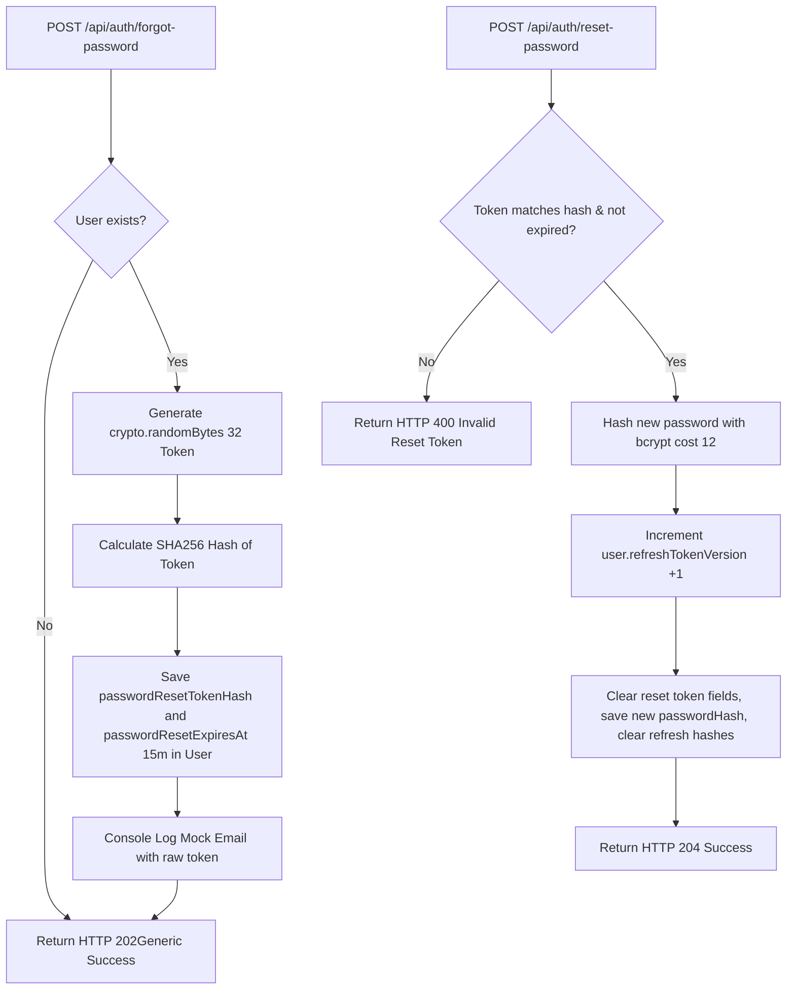
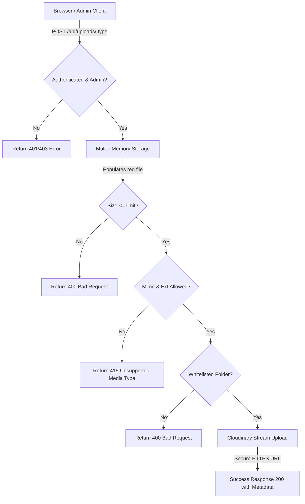

# Security Policy & Implementation Reference

This document outlines the security strategy, implementation details, and checklists for the portfolio CMS ecosystem backend.

## 1. Authentication Flow Diagram

The following sequence illustrates a user logging in and rotating their sessions using Refresh Token Rotation (RTR).



## 2. Access Token Lifecycle

- **Access Tokens**: Short-lived JSON Web Tokens (JWT) signed with a strong secret (`JWT_ACCESS_SECRET`).
  - **Lifetime**: 15 minutes.
  - **Claims**: 
    ```json
    {
      "sub": "userId",
      "role": "admin",
      "email": "admin@example.com",
      "tokenVersion": 0
    }
    ```
  - **Storage**: Sent in the response JSON envelope body (`meta.accessToken`). Access tokens are **never** stored in cookies. In client applications, they are kept in-memory and are never written to `localStorage` or `sessionStorage` to mitigate Cross-Site Scripting (XSS) extraction.
  - **Verification**: Verified using the `JWT_ACCESS_SECRET`. The middleware verifies both the signature and check that the token's `tokenVersion` matches the user's `refreshTokenVersion` in the database to allow immediate token revocation.

## 3. Refresh Token Rotation (RTR) Flow

To prevent replay attacks and detect refresh token hijacking:
- **Lifetime**: 7 days.
- **Claims**: `{ sub: userId, tokenVersion }`.
- **Database Hardening**: Raw refresh tokens are never stored. The database stores `refreshTokenHash` (SHA256 hash of the token), `refreshTokenVersion`, and `refreshTokenExpiresAt`.
- **Verification**:
  - The incoming refresh token is verified against the signature.
  - The incoming token is hashed using SHA256.
  - The database matches this hash against `user.refreshTokenHash`.
  - The database verifies that the current timestamp is less than `user.refreshTokenExpiresAt`.
  - The `decoded.tokenVersion` matches `user.refreshTokenVersion`.
- **Hijack Protection**: If a token version mismatch or hash mismatch occurs, it suggests token theft. The server immediately increments `user.refreshTokenVersion` to invalidate the entire session family, clears the token hashes, saves the record, and returns a `403 Forbidden` response forcing re-authentication.

## 4. Password Reset Flow



## 5. Cookie Strategy

- Rotated refresh tokens are stored in an HttpOnly cookie named `refreshToken`.
- **HttpOnly**: Restricts client-side scripts from reading the cookie, neutralizing XSS exfiltration.
- **Secure**: Restricts cookie transmission to encrypted HTTPS connections only (disabled in `test`/`development` environments, strictly enabled in `production`).
- **SameSite**: 
  - `development` -> `Lax` (simplifies cross-origin localhost development testing)
  - `production` -> `Strict` (guards against CSRF vectors by blocking the cookie from third-party cross-site requests).
- **Path**: Constrained to `/api/auth/refresh` to restrict the browser from transmitting it on other API endpoint routes.
- **maxAge**: 7 days (`7 * 24 * 60 * 60 * 1000`).

## 6. Rate Limiting

We enforce rate limit restrictions via `express-rate-limit`:
- **Authentication**: Limit to 5 requests per 15 minutes per IP (`authLimiter` applied to `/login`, `/forgot-password`, and `/reset-password`).
- **Contact Forms**: Limit to 20 requests per 15 minutes per IP (`contactLimiter` applied to `/contact`).
- **Global API Calls**: Limit to 100 requests per 15 minutes per IP (`apiLimiter` applied globally on `/api/*`).

## 7. CORS (Cross-Origin Resource Sharing)

- CORS checks request origin against a strict allowlist containing:
  - `http://localhost:5173` (Vite portfolio)
  - `http://localhost:5174` (Vite dashboard)
  - Production configurations `env.FRONTEND_URL` and `env.ADMIN_URL`.
- **Credentials Allowed**: Enabled (`credentials: true`) to support cookie transmissions.
- Wildcards (`*`) are prohibited when credentials are enabled.

## 8. Helmet Content Security Policy (CSP)

Helmet header guards enforce:
- **default-src**: `['self']`
- **img-src**: `['self', 'https:', 'data:']`
- **script-src**: `['self']`
- **style-src**: `['self', 'unsafe-inline']`
- **xssFilter**: Enabled.
- **noSniff**: Enabled (`nosniff`).
- **frameguard**: Enabled (`SAMEORIGIN`).

## 9. Future Roadmap: Multi-Factor Authentication (MFA)

To transition this single-admin CMS to a high-security admin surface, future phases will support:
- Time-based One-Time Passwords (TOTP) using standard authenticator apps (e.g. Google Authenticator).
- Backup recovery codes stored as secure single-use hashes.
- Endpoint validation forcing MFA challenges for settings updates or user password resets.

## 10. Media Upload Security Policy

The file upload pipeline employs strict validation boundaries and integrates with Cloudinary to deliver secure, optimized media delivery with zero local storage footprint.

### 10.1 Upload Flow Diagram


### 10.2 Media Types and Validation Configuration
Validation is executed in a fail-fast order (File exists -> MIME -> Extension -> File size -> Whitelisted folder). 

The allowed configurations by category are:
- **PROFILE** (`portfolio/profile`): JPEG, PNG, WebP only. Maximum size: 5 MB.
- **PROJECTS** (`portfolio/projects`): JPEG, PNG, WebP, GIF only. Maximum size: 10 MB.
- **CERTIFICATES** (`portfolio/certificates`): JPEG, PNG, WebP, PDF only. Maximum size: 10 MB.
- **BLOGS** (`portfolio/blogs`): JPEG, PNG, WebP only. Maximum size: 8 MB.
- **RESUMES** (`portfolio/resumes`): PDF only. Maximum size: 5 MB.
- **TESTIMONIALS** (`portfolio/testimonials`): JPEG, PNG, WebP only. Maximum size: 5 MB.

### 10.3 Blocked and Dangerous Media
To prevent server hijack, cross-site scripting (XSS), or injection vectors, the following file formats are explicitly blacklisted and return a `415 Unsupported Media Type` response:
*   **Vector Formats**: `svg` (blocked to prevent XML External Entity (XXE) and script injections inside SVG images).
*   **Executables**: `exe`, `bat`, `apk`, `dll`, `sh`, `php`, `html`, `js` (blocked to prevent malicious script uploads).
*   **Archive Types**: `zip`, `rar` (blocked to prevent zip bomb extraction vectors).

### 10.4 Cloudinary Secure Settings
- **Direct Streaming**: Files are parsed using `multer.memoryStorage()` and piped directly into `cloudinary.uploader.upload_stream` using buffer stream endpoints. Local disk writes (`multer.diskStorage()`, temp files) are strictly prohibited.
- **TLS Delivery**: Cloudinary configuration forces `secure: true` globally, ensuring all generated delivery URLs utilize HTTPS.
- **Transformations and Metadata Stripping**: Upload options apply `flags: "strip_profile"`, stripping out camera, color profile, and geolocation EXIF metadata. Images are auto-optimized using `quality: "auto"` and `fetch_format: "auto"` with scale limits (`crop: "limit"`).

### 10.5 Deletion Security & Directory Traversal Prevention
Before executing a deletion query on Cloudinary:
*   The `publicId` parameter is checked to confirm it starts with a whitelisted folder (e.g. `portfolio/profile/`).
*   Paths containing directory traversal signatures (such as `../`) are rejected with a `400 Bad Request` (`INVALID_PUBLIC_ID`), preventing arbitrary file deletions outside our whitelisted folders.
*   Asset presence is verified on Cloudinary, returning `404` if the asset has already been deleted or is missing.

