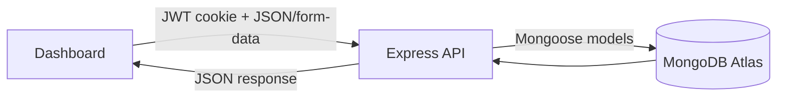
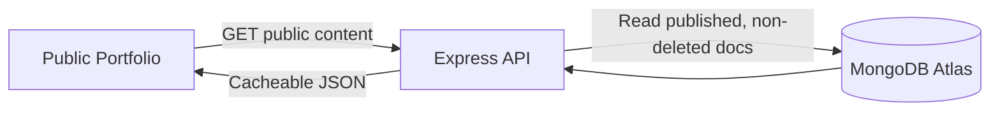
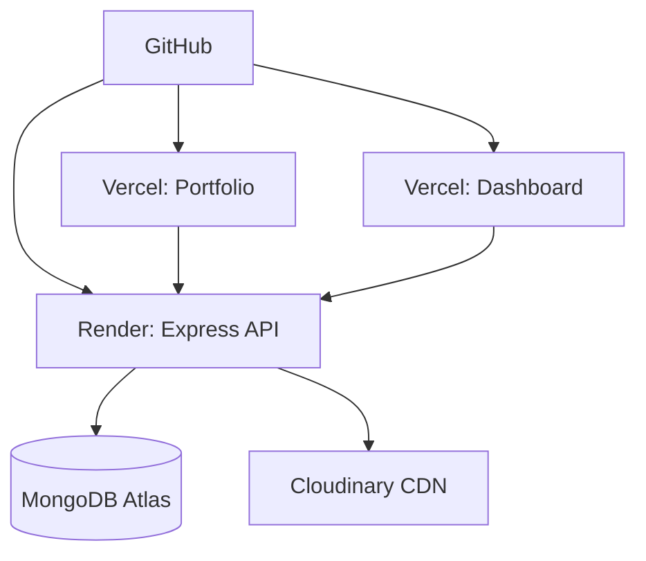

# Portfolio CMS Ecosystem Architecture Review

**Status:** Design proposal only. No application code has been changed.

**Current baseline audited:** `portfolio/` is the active React + Vite frontend and Express + MongoDB backend. `portoflio/` is a separate Next.js + Payload CMS workspace/template with a misspelled directory name.

**Architecture verdict:** the current portfolio is a good public-site prototype, but it is not a CMS ecosystem yet. It should not be scaled by adding more ad hoc routes and models. The public UI can be kept and progressively migrated, but the backend structure, data model, auth, content workflow, uploads, testing, and deployment discipline need a real rewrite.

## 0. Critical Review Summary

### What Is Good

- The public portfolio already exists and has a recognizable visual direction.
- React + Vite is a sensible choice for a fast public portfolio.
- Express + MongoDB is appropriate for a custom MERN CMS and keeps the resume story coherent.
- Existing `Project`, `Skill`, and contact message features prove the frontend can consume API-backed content.
- The codebase is small enough to migrate safely in milestones.

### What Is Bad

- Content ownership is split between MongoDB, seed data, frontend constants, public assets, and JSX copy. That directly violates the "never edit code for content changes" goal.
- The API is currently a public read/write surface with no real security boundary.
- The backend has no layered architecture. Routes talk directly to Mongoose models, which will become messy as soon as dashboard CRUD, validation, auth, analytics, uploads, and search are added.
- There is no admin domain model: no drafts, publish states, slugs, audit metadata, soft deletes, reorder APIs, or content previews.
- There is no contract between frontend and backend. API response shapes are whatever each route returns.
- There is no test safety net before a major CMS migration.
- `portoflio/` creates architectural ambiguity: custom MERN CMS vs Payload CMS. Keeping both active will make the project feel unfinished and hard to explain.

### What Should Be Kept

- Keep React + Vite for the public portfolio.
- Keep Express + MongoDB for a custom MERN CMS if the goal is to showcase full-stack ownership.
- Keep the current visual identity as a starting point, but make content dynamic.
- Keep Vercel for portfolio/dashboard and MongoDB Atlas for the database.
- Keep existing seed data only as migration input, not as the long-term content source.

### What Should Be Rewritten

- Rewrite the backend into module-based architecture with controllers, services, repositories/models, validators, middleware, and centralized errors.
- Rewrite schemas with timestamps, indexes, status, soft delete, slugs, validation, and audit fields.
- Rewrite API responses into a consistent `{ data, meta }` / `{ error }` envelope.
- Rewrite frontend data fetching around React Query and a shared API client.
- Rewrite skills/social/profile/resume/static content into API-backed CMS content.
- Rewrite deployment docs and environment handling.

### What Should Be Retired or Archived

- Archive or intentionally rename `portoflio/`. Do not leave it as an unexplained second CMS direction.
- Retire one-off frontend data constants for content that belongs in the CMS.
- Retire raw route-level validation and replace it with shared schemas.

### Highest-Risk Problems

| Area | Problem | Risk | Fix |
| --- | --- | --- | --- |
| Auth | No admin auth exists | Anyone could access future write APIs if added casually | Build auth before dashboard CRUD |
| Data | No status/soft delete/index strategy | Drafts leak publicly, deletes are destructive, queries degrade | Add standard fields and query filters |
| API | No validation/response contract | Dashboard and portfolio will drift | Shared Zod schemas and API client |
| Security | No rate limits, Helmet, CSRF, sanitization | Contact spam, auth brute force, XSS, bad writes | Security middleware baseline |
| Content | Hardcoded profile/skills/social assets | Code edits remain necessary | Move content into Settings/content modules |
| Repo | Two competing app trees | Confusing architecture and deployment | Choose custom MERN CMS or Payload, not both |
| Testing | No regression tests | Migration can silently break public portfolio | Add tests before major rewrites |

## 1. Architecture Review

### Current Strengths

- Clear frontend/backend split in `portfolio/client` and `portfolio/server`.
- Small Express API is easy to understand and deploy.
- MongoDB + Mongoose is a good fit for flexible portfolio content.
- Public portfolio already consumes API data for projects and contact messages.
- Vite frontend is fast and simple for a public portfolio.

### Current Weaknesses

- No admin dashboard exists for content management.
- No authentication, authorization, refresh tokens, or protected routes.
- Only three backend collections exist: `Project`, `Skill`, and `Message`.
- Most portfolio content is still hardcoded in frontend files such as skills, contact links, profile text, navigation, education, and static assets.
- Backend has route logic directly inside route files; no controllers, services, validators, shared error handler, or response envelope.
- Mongoose schemas have limited validation, no timestamps, no soft delete, no indexes, and no ownership/audit fields.
- No tests, linting, CI, health checks beyond `/api/health`, centralized logging, monitoring, or error tracking.
- README references `MONGO_URI`, but server code expects `MONGODB_URI`.
- Two app directions exist at once: custom MERN in `portfolio/` and Payload CMS in `portoflio/`. This is currently confusing and should be resolved.

### Separate Repos vs Monorepo

| Option | Pros | Cons |
| --- | --- | --- |
| Separate repos for portfolio, dashboard, server | Independent deploys, simpler small repo permissions, easier if apps have unrelated teams | Shared types/utilities drift, duplicated API clients, harder refactors, harder local setup, more CI/config repetition |
| Monorepo with `apps/portfolio`, `apps/dashboard`, `server`, `packages/shared` | Shared types, one source of truth, unified scripts, atomic changes across API/schema/UI, easier local dev, cleaner long-term scaling | Needs workspace discipline, CI should only build affected apps, initial migration work |

**Recommendation:** Use a monorepo. This project is one product ecosystem, not three unrelated products. The portfolio, dashboard, API contracts, schemas, and content types will evolve together. A monorepo gives the best long-term maintainability.

## 2. Target System Architecture

```txt
Portfolio-2/
├─ apps/
│  ├─ portfolio/          # Public React + Vite portfolio
│  ├─ dashboard/          # Private React + Vite admin dashboard
├─ server/                 # Express API + Mongoose
├─ packages/
│  ├─ shared/             # Types, constants, validators, DTOs
│  ├─ api-client/         # Axios/fetch client used by portfolio and dashboard
│  └─ ui/                 # Shared dashboard/portfolio primitives only if useful
├─ docs/
├─ package.json
├─ pnpm-workspace.yaml
└─ turbo.json
```

This shape matches the product boundary: `apps/` contains browser applications, `server/` contains the API service, and `packages/` contains code reused across those boundaries. The key rule is that `server/` must be treated as a first-class workspace package, not as a loose folder beside the real apps.

### Detailed Target Folder Structure

```txt
Portfolio-2/
├─ apps/
│  ├─ portfolio/
│  │  ├─ src/
│  │  │  ├─ app/
│  │  │  ├─ pages/
│  │  │  ├─ features/
│  │  │  ├─ components/
│  │  │  ├─ hooks/
│  │  │  └─ styles/
│  │  ├─ index.html
│  │  └─ package.json
│  └─ dashboard/
│     ├─ src/
│     │  ├─ app/
│     │  ├─ layouts/
│     │  ├─ features/
│     │  ├─ components/
│     │  └─ styles/
│     ├─ index.html
│     └─ package.json
├─ server/
│  ├─ src/
│  │  ├─ app.js
│  │  ├─ server.js
│  │  ├─ config/
│  │  ├─ db/
│  │  ├─ middleware/
│  │  ├─ modules/
│  │  ├─ utils/
│  │  └─ jobs/
│  ├─ tests/
│  └─ package.json
├─ packages/
│  ├─ shared/
│  ├─ api-client/
│  └─ ui/
└─ docs/
```

Why each major folder exists:

- `apps/portfolio`: public-facing experience optimized for speed, SEO, accessibility, and content rendering.
- `apps/dashboard`: private content operating system for the single admin.
- `server`: the only trusted boundary for auth, writes, uploads, analytics, validation, and database access.
- `packages/shared`: enums, validators, DTOs, route constants, and shared TypeScript types.
- `packages/api-client`: typed HTTP client consumed by both frontend apps.
- `packages/ui`: low-level UI primitives that genuinely benefit both apps.
- `docs`: architecture, runbooks, implementation plans, deployment diagrams, and API specs.

### Import Strategy

- `@portfolio/shared`: enums, Zod schemas, DTO types, route constants.
- `@portfolio/api-client`: typed API functions and Axios instance.
- `@portfolio/ui`: only truly shared primitives, not page-specific sections.
- App-local imports remain inside each app for feature components.

### Data Flow





### Build and Deployment

- Package manager: `pnpm`.
- Task runner: Turborepo.
- Portfolio: Vercel static build.
- Dashboard: Vercel static build behind authenticated API.
- Server: Render web service or Railway/Fly.io if stronger observability and scaling are needed.
- Database: MongoDB Atlas with daily backups.
- Media: Cloudinary.

## 3. MongoDB Collection Design

All collections should use:

- `timestamps: true`
- `isDeleted: { type: Boolean, default: false, index: true }`
- `deletedAt: Date`
- `createdBy`, `updatedBy`, `deletedBy` references to `User` where relevant
- public queries filtered by `{ isDeleted: false, status: 'published' }`

### User

```js
const userSchema = new Schema({
  name: { type: String, required: true, trim: true, minlength: 2, maxlength: 80 },
  email: { type: String, required: true, unique: true, lowercase: true, trim: true, index: true },
  passwordHash: { type: String, required: true, select: false },
  role: { type: String, enum: ['admin'], default: 'admin', required: true },
  avatarUrl: { type: String, default: '' },
  lastLoginAt: Date,
  passwordResetTokenHash: { type: String, select: false },
  passwordResetExpiresAt: Date,
  refreshTokenVersion: { type: Number, default: 0 },
  isDeleted: { type: Boolean, default: false, index: true },
  deletedAt: Date
}, { timestamps: true })
userSchema.index({ email: 1, isDeleted: 1 })
```

### Settings

```js
const settingsSchema = new Schema({
  singletonKey: { type: String, enum: ['main'], default: 'main', unique: true },
  profile: {
    fullName: { type: String, required: true },
    headline: { type: String, required: true },
    bio: { type: String, required: true },
    location: String,
    email: { type: String, required: true },
    phone: String,
    profileImageUrl: String,
    resumeUrl: String
  },
  seo: {
    title: { type: String, required: true },
    description: { type: String, required: true, maxlength: 160 },
    keywords: [String],
    ogImageUrl: String
  },
  socials: [{ platform: String, label: String, url: String, order: Number }],
  availability: {
    status: { type: String, enum: ['available', 'busy', 'unavailable'], default: 'available' },
    note: String
  },
  theme: { accentColor: String, mode: { type: String, enum: ['dark'], default: 'dark' } },
  status: { type: String, enum: ['draft', 'published', 'archived'], default: 'published', index: true },
  isDeleted: { type: Boolean, default: false, index: true },
  deletedAt: Date
}, { timestamps: true })
```

### Project

```js
const projectSchema = new Schema({
  title: { type: String, required: true, trim: true, maxlength: 120 },
  slug: { type: String, required: true, unique: true, lowercase: true, index: true },
  subtitle: { type: String, default: '', maxlength: 160 },
  summary: { type: String, required: true, maxlength: 300 },
  description: { type: String, required: true },
  techStack: [{ type: String, trim: true }],
  category: { type: String, enum: ['web', 'ai', 'mobile', 'data', 'design', 'security', 'other'], default: 'web', index: true },
  status: { type: String, enum: ['draft', 'published', 'archived'], default: 'draft', index: true },
  projectStatusLabel: { type: String, default: 'Live' },
  featured: { type: Boolean, default: false, index: true },
  order: { type: Number, default: 0, index: true },
  image: { url: String, alt: String, publicId: String },
  gallery: [{ url: String, alt: String, publicId: String }],
  liveUrl: String,
  githubUrl: String,
  caseStudyUrl: String,
  highlights: [String],
  metrics: [{ label: String, value: String }],
  startedAt: Date,
  completedAt: Date,
  isDeleted: { type: Boolean, default: false, index: true },
  deletedAt: Date
}, { timestamps: true })
projectSchema.index({ status: 1, featured: -1, order: 1, isDeleted: 1 })
projectSchema.index({ title: 'text', summary: 'text', description: 'text', techStack: 'text' })
```

### Skill

```js
const skillSchema = new Schema({
  name: { type: String, required: true, trim: true },
  slug: { type: String, required: true, unique: true, lowercase: true },
  category: { type: String, required: true, enum: ['frontend', 'backend', 'database', 'devops', 'language', 'ai', 'tool', 'security'], index: true },
  proficiency: { type: Number, min: 0, max: 100, default: 80 },
  icon: String,
  learning: { type: Boolean, default: false },
  featured: { type: Boolean, default: false },
  order: { type: Number, default: 0, index: true },
  status: { type: String, enum: ['draft', 'published', 'archived'], default: 'published', index: true },
  isDeleted: { type: Boolean, default: false, index: true },
  deletedAt: Date
}, { timestamps: true })
skillSchema.index({ category: 1, order: 1, isDeleted: 1 })
```

### Certificate

```js
const certificateSchema = new Schema({
  title: { type: String, required: true },
  issuer: { type: String, required: true, index: true },
  credentialId: String,
  credentialUrl: String,
  image: { url: String, alt: String, publicId: String },
  issuedAt: { type: Date, required: true, index: true },
  expiresAt: Date,
  skills: [{ type: Schema.Types.ObjectId, ref: 'Skill' }],
  status: { type: String, enum: ['draft', 'published', 'archived'], default: 'published', index: true },
  featured: { type: Boolean, default: false },
  order: { type: Number, default: 0 },
  isDeleted: { type: Boolean, default: false, index: true },
  deletedAt: Date
}, { timestamps: true })
certificateSchema.index({ issuedAt: -1, isDeleted: 1 })
```

### Experience

```js
const experienceSchema = new Schema({
  company: { type: String, required: true },
  role: { type: String, required: true },
  location: String,
  type: { type: String, enum: ['internship', 'full-time', 'part-time', 'contract', 'freelance', 'volunteer'], required: true },
  startDate: { type: Date, required: true, index: true },
  endDate: Date,
  current: { type: Boolean, default: false },
  summary: { type: String, required: true },
  bullets: [{ type: String, maxlength: 240 }],
  techStack: [String],
  companyUrl: String,
  status: { type: String, enum: ['draft', 'published', 'archived'], default: 'published', index: true },
  order: { type: Number, default: 0 },
  isDeleted: { type: Boolean, default: false, index: true },
  deletedAt: Date
}, { timestamps: true })
experienceSchema.index({ startDate: -1, isDeleted: 1 })
```

### Blog

```js
const blogSchema = new Schema({
  title: { type: String, required: true, maxlength: 140 },
  slug: { type: String, required: true, unique: true, lowercase: true, index: true },
  excerpt: { type: String, required: true, maxlength: 220 },
  content: { type: String, required: true },
  coverImage: { url: String, alt: String, publicId: String },
  tags: [{ type: String, index: true }],
  status: { type: String, enum: ['draft', 'published', 'archived'], default: 'draft', index: true },
  publishedAt: Date,
  readingTimeMinutes: { type: Number, min: 1 },
  seo: { title: String, description: String, keywords: [String] },
  isDeleted: { type: Boolean, default: false, index: true },
  deletedAt: Date
}, { timestamps: true })
blogSchema.index({ status: 1, publishedAt: -1, isDeleted: 1 })
blogSchema.index({ title: 'text', excerpt: 'text', content: 'text', tags: 'text' })
```

### Timeline

```js
const timelineSchema = new Schema({
  title: { type: String, required: true },
  type: { type: String, enum: ['education', 'project', 'award', 'experience', 'personal'], required: true, index: true },
  description: { type: String, required: true },
  date: { type: Date, required: true, index: true },
  endDate: Date,
  icon: String,
  relatedProject: { type: Schema.Types.ObjectId, ref: 'Project' },
  status: { type: String, enum: ['draft', 'published', 'archived'], default: 'published', index: true },
  order: { type: Number, default: 0 },
  isDeleted: { type: Boolean, default: false, index: true },
  deletedAt: Date
}, { timestamps: true })
timelineSchema.index({ date: -1, isDeleted: 1 })
```

### Achievement

```js
const achievementSchema = new Schema({
  title: { type: String, required: true },
  issuer: String,
  description: { type: String, required: true },
  date: { type: Date, required: true, index: true },
  category: { type: String, enum: ['award', 'hackathon', 'academic', 'open-source', 'milestone', 'other'], required: true },
  proofUrl: String,
  image: { url: String, alt: String, publicId: String },
  featured: { type: Boolean, default: false },
  status: { type: String, enum: ['draft', 'published', 'archived'], default: 'published', index: true },
  order: { type: Number, default: 0 },
  isDeleted: { type: Boolean, default: false, index: true },
  deletedAt: Date
}, { timestamps: true })
achievementSchema.index({ category: 1, date: -1, isDeleted: 1 })
```

### VisitorAnalytics

```js
const visitorAnalyticsSchema = new Schema({
  visitorIdHash: { type: String, required: true, index: true },
  sessionId: { type: String, required: true, index: true },
  path: { type: String, required: true, index: true },
  referrer: String,
  country: String,
  device: { type: String, enum: ['desktop', 'mobile', 'tablet', 'bot', 'unknown'], default: 'unknown', index: true },
  browser: String,
  os: String,
  userAgentHash: String,
  ipHash: String,
  durationSeconds: { type: Number, default: 0 },
  eventType: { type: String, enum: ['pageview', 'session_end', 'click'], default: 'pageview', index: true },
  occurredAt: { type: Date, default: Date.now, index: true },
  isDeleted: { type: Boolean, default: false, index: true },
  deletedAt: Date
}, { timestamps: true })
visitorAnalyticsSchema.index({ occurredAt: -1, path: 1 })
visitorAnalyticsSchema.index({ sessionId: 1, occurredAt: 1 })
```

### Testimonial

```js
const testimonialSchema = new Schema({
  name: { type: String, required: true },
  role: String,
  company: String,
  message: { type: String, required: true, maxlength: 800 },
  avatarUrl: String,
  rating: { type: Number, min: 1, max: 5 },
  sourceUrl: String,
  status: { type: String, enum: ['draft', 'published', 'archived'], default: 'draft', index: true },
  featured: { type: Boolean, default: false },
  order: { type: Number, default: 0 },
  isDeleted: { type: Boolean, default: false, index: true },
  deletedAt: Date
}, { timestamps: true })
testimonialSchema.index({ status: 1, featured: -1, order: 1, isDeleted: 1 })
```

### ContactMessage

```js
const contactMessageSchema = new Schema({
  name: { type: String, required: true, trim: true, maxlength: 120 },
  email: { type: String, required: true, lowercase: true, trim: true, index: true },
  subject: { type: String, required: true, maxlength: 160 },
  message: { type: String, required: true, maxlength: 5000 },
  status: { type: String, enum: ['unread', 'read', 'replied', 'archived'], default: 'unread', index: true },
  source: { type: String, enum: ['portfolio', 'dashboard', 'api'], default: 'portfolio' },
  ipHash: String,
  userAgentHash: String,
  isDeleted: { type: Boolean, default: false, index: true },
  deletedAt: Date
}, { timestamps: true })
contactMessageSchema.index({ createdAt: -1, status: 1, isDeleted: 1 })
```

### Field Rationale

| Field Pattern | Used In | Why It Exists |
| --- | --- | --- |
| `title`, `name`, `role`, `company`, `issuer` | Content identity fields | Human-readable labels for dashboard tables, SEO headings, and public UI cards |
| `slug` | Project, Blog, Skill | Stable public URLs and safe lookups without exposing Mongo IDs |
| `summary`, `excerpt`, `description`, `bio`, `message` | Public content | Separates compact card copy from long-form detail copy |
| `status` | Settings, Project, Skill, Certificate, Experience, Blog, Timeline, Achievement, Testimonial | Enables draft, published, and archived workflows without code deploys |
| `featured` | Project, Skill, Certificate, Achievement, Testimonial | Lets the dashboard control homepage/high-priority placement |
| `order` | Ordered content modules | Enables drag-and-drop ordering and stable public display |
| `image`, `coverImage`, `gallery`, `avatarUrl`, `resumeUrl` | Media-backed modules | Stores optimized Cloudinary metadata and accessible alt text |
| `techStack`, `skills`, `tags` | Project, Certificate, Experience, Blog | Enables filters, search, grouping, and future recommendation surfaces |
| `seo` | Settings, Blog | Allows title, description, keywords, and OG images to change without editing code |
| `createdBy`, `updatedBy`, `deletedBy` | Admin-managed collections | Audit trail for future multi-admin expansion, even if only one admin exists now |
| `isDeleted`, `deletedAt` | All collections | Soft delete prevents accidental data loss and supports restore workflows |
| `createdAt`, `updatedAt` | All collections | Required for sorting, audit history, analytics, and dashboard freshness indicators |
| `visitorIdHash`, `sessionId`, `ipHash`, `userAgentHash` | VisitorAnalytics | Tracks useful analytics without storing raw personal identifiers |

Query optimization rules:

- Public content queries always include `{ status: 'published', isDeleted: false }`.
- Dashboard list queries use compound indexes such as `{ status: 1, order: 1, isDeleted: 1 }`.
- Text search uses MongoDB text indexes for lightweight search; move to Atlas Search only if search becomes a real product feature.
- Analytics dashboards query by date range first, so `occurredAt` must lead analytics indexes.
- Slugs are unique because they become public URLs and should not change accidentally.

## 4. Authentication and Security

### Auth Design

- Single seeded admin user.
- Access token: short-lived JWT, 10 to 15 minutes.
- Refresh token: opaque random token or JWT with token version, 7 to 30 days.
- Store refresh token in `httpOnly`, `secure`, `sameSite='strict'` cookie.
- Store access token in memory in the dashboard or use `httpOnly` cookie plus CSRF token.
- Rotate refresh token on every `/auth/refresh`.
- Increment `refreshTokenVersion` on password reset/logout-all.
- Protect dashboard APIs with `requireAuth` and `requireRole('admin')`.

### Security Checklist

- Hash passwords with Argon2id or bcrypt cost 12+.
- Use `helmet`.
- Use strict CORS allowlist for portfolio and dashboard origins.
- Use `express-rate-limit` for auth/contact/upload endpoints.
- Use `express-mongo-sanitize` or strict validators to prevent Mongo operator injection.
- Use Zod/Joi validation for every request body/query/params.
- Use `hpp` to prevent HTTP parameter pollution.
- Use cookie CSRF protection for cookie-authenticated mutation routes.
- Sanitize rich text using a strict allowlist before rendering.
- Validate upload MIME type and size.
- Never expose stack traces in production.
- Centralize error handling and audit logging.
- Add account lockout/backoff after repeated failed login attempts.

## 5. REST API Design

All protected routes use: `requireAuth`, `requireRole('admin')`, validation middleware, centralized error handler.

All list endpoints support: `page`, `limit`, `search`, `status`, `sort`, `includeDeleted`.

### Auth

| Endpoint | Body | Success | Errors |
| --- | --- | --- | --- |
| `POST /api/auth/login` | `{ email, password }` | `200 { user, accessToken }` + refresh cookie | `400`, `401`, `429` |
| `POST /api/auth/logout` | none | `204` clears refresh cookie | `401` |
| `POST /api/auth/refresh` | refresh cookie | `200 { accessToken }` + rotated cookie | `401`, `403` |
| `POST /api/auth/forgot-password` | `{ email }` | `202 { message }` | always generic, `429` |
| `POST /api/auth/reset-password` | `{ token, password }` | `204` | `400`, `410` |

### Content Modules

Use the same pattern for `projects`, `skills`, `certificates`, `experience`, `blogs`, `timeline`, `achievements`, and `testimonials`.

| Endpoint | Purpose | Body | Success |
| --- | --- | --- | --- |
| `GET /api/:resource` | Public/admin list | query params | `200 { data, meta }` |
| `GET /api/:resource/:idOrSlug` | Public/admin detail | none | `200 { data }` |
| `POST /api/:resource` | Create | resource schema | `201 { data }` |
| `PUT /api/:resource/:id` | Full update | resource schema | `200 { data }` |
| `PATCH /api/:resource/:id` | Partial update | partial schema | `200 { data }` |
| `DELETE /api/:resource/:id` | Soft delete | none | `204` |
| `PATCH /api/:resource/reorder` | Reorder | `{ items: [{ id, order }] }` | `200 { data }` |

### Special Endpoints

| Endpoint | Body/Query | Purpose |
| --- | --- | --- |
| `PATCH /api/projects/:id/feature` | `{ featured }` | Toggle featured project |
| `GET /api/settings` | none | Public settings |
| `PUT /api/settings` | settings schema | Admin settings update |
| `POST /api/contact/messages` | `{ name, email, subject, message }` | Public contact submission |
| `GET /api/contact/messages` | filters | Admin inbox |
| `DELETE /api/contact/messages/:id` | none | Soft delete message |
| `POST /api/analytics/pageview` | `{ path, referrer, sessionId }` | Track public visit |
| `PATCH /api/analytics/session` | `{ sessionId, durationSeconds }` | Update session duration |
| `GET /api/analytics` | date range | Dashboard metrics |
| `POST /api/uploads/signature` | `{ folder, resourceType }` | Cloudinary signed upload |
| `DELETE /api/uploads/:publicId` | none | Delete media asset |

### Response Shape

```json
{
  "data": {},
  "meta": {
    "page": 1,
    "limit": 20,
    "total": 100,
    "totalPages": 5
  }
}
```

### Error Shape

```json
{
  "error": {
    "code": "VALIDATION_ERROR",
    "message": "Request validation failed",
    "details": [{ "field": "title", "message": "Title is required" }]
  }
}
```

### Detailed Endpoint Contract

Common middleware:

- Public reads: `validateQuery`, `cacheHeaders`, `notFoundHandler`.
- Admin writes: `requireAuth`, `requireRole('admin')`, `csrfProtection`, `validateBody`, `auditLog`.
- Contact/analytics writes: `rateLimit`, `validateBody`, `sanitizeInput`.
- Uploads: `requireAuth`, `requireRole('admin')`, `validateUploadIntent`.

#### Auth Endpoints

| Endpoint | Request Body | Response | Status Codes | Validation | Middleware |
| --- | --- | --- | --- | --- | --- |
| `POST /api/auth/login` | `{ "email": "admin@example.com", "password": "string" }` | `{ "data": { "user": { "id": "...", "email": "...", "role": "admin" }, "accessToken": "..." } }` plus refresh cookie | `200`, `400`, `401`, `423`, `429` | valid email, password min 8 | login rate limit, validate body |
| `POST /api/auth/logout` | none | empty body | `204`, `401` | refresh cookie required if present | require auth optional, clear cookie |
| `POST /api/auth/refresh` | refresh cookie | `{ "data": { "accessToken": "..." } }` plus rotated refresh cookie | `200`, `401`, `403` | valid refresh token/session | cookie parser, token rotation |
| `POST /api/auth/forgot-password` | `{ "email": "admin@example.com" }` | `{ "data": { "message": "If the account exists, reset instructions were sent." } }` | `202`, `400`, `429` | valid email | auth rate limit |
| `POST /api/auth/reset-password` | `{ "token": "...", "password": "newStrongPassword" }` | empty body | `204`, `400`, `410`, `429` | token required, strong password | auth rate limit, validate body |

Auth error responses:

- `401 INVALID_CREDENTIALS`
- `401 TOKEN_EXPIRED`
- `403 TOKEN_REUSED_OR_REVOKED`
- `423 ACCOUNT_TEMPORARILY_LOCKED`
- `429 RATE_LIMITED`

#### Projects

| Endpoint | Request Body | Response | Status Codes | Validation | Middleware |
| --- | --- | --- | --- | --- | --- |
| `GET /api/projects` | query: `page`, `limit`, `search`, `status`, `featured`, `sort` | `{ data: Project[], meta }` | `200`, `400` | query limits, valid status | public or admin query scope |
| `GET /api/projects/:id` | none | `{ data: Project }` | `200`, `404` | Mongo ID or slug | public/admin scope |
| `POST /api/projects` | project create DTO | `{ data: Project }` | `201`, `400`, `401`, `403`, `409` | title, slug, summary, description required | admin write stack |
| `PUT /api/projects/:id` | full project DTO | `{ data: Project }` | `200`, `400`, `401`, `403`, `404`, `409` | full schema | admin write stack |
| `DELETE /api/projects/:id` | none | empty body | `204`, `401`, `403`, `404` | valid ID | admin write stack |
| `PATCH /api/projects/:id/feature` | `{ "featured": true }` | `{ data: Project }` | `200`, `400`, `401`, `403`, `404` | boolean featured | admin write stack |
| `PATCH /api/projects/reorder` | `{ "items": [{ "id": "...", "order": 1 }] }` | `{ data: Project[] }` | `200`, `400`, `401`, `403` | non-empty ID/order array | admin write stack |

#### Reusable CRUD Contract

Applies to `skills`, `certificates`, `experience`, `blogs`, `timeline`, `achievements`, and `testimonials`.

| Endpoint | Request Body | Response | Status Codes | Validation | Middleware |
| --- | --- | --- | --- | --- | --- |
| `GET /api/{resource}` | query: `page`, `limit`, `search`, `status`, `sort` | `{ data: Resource[], meta }` | `200`, `400` | known filters only | public/admin query scope |
| `GET /api/{resource}/:id` | none | `{ data: Resource }` | `200`, `404` | Mongo ID or slug where supported | public/admin query scope |
| `POST /api/{resource}` | resource create DTO | `{ data: Resource }` | `201`, `400`, `401`, `403`, `409` | required fields per schema | admin write stack |
| `PUT /api/{resource}/:id` | full resource DTO | `{ data: Resource }` | `200`, `400`, `401`, `403`, `404`, `409` | full schema | admin write stack |
| `PATCH /api/{resource}/:id` | partial resource DTO | `{ data: Resource }` | `200`, `400`, `401`, `403`, `404`, `409` | partial schema | admin write stack |
| `DELETE /api/{resource}/:id` | none | empty body | `204`, `401`, `403`, `404` | valid ID | admin write stack |
| `PATCH /api/{resource}/reorder` | `{ "items": [{ "id": "...", "order": 1 }] }` | `{ data: Resource[] }` | `200`, `400`, `401`, `403` | ID/order array | admin write stack |

Required body highlights:

- Skills: `name`, `slug`, `category`, `status`.
- Certificates: `title`, `issuer`, `issuedAt`, `status`.
- Experience: `company`, `role`, `type`, `startDate`, `summary`, `status`.
- Blogs: `title`, `slug`, `excerpt`, `content`, `status`.
- Timeline: `title`, `type`, `description`, `date`, `status`.
- Achievements: `title`, `description`, `date`, `category`, `status`.
- Testimonials: `name`, `message`, `status`.

#### Settings

| Endpoint | Request Body | Response | Status Codes | Validation | Middleware |
| --- | --- | --- | --- | --- | --- |
| `GET /api/settings` | none | `{ data: Settings }` | `200`, `404` | singleton only | public read |
| `PUT /api/settings` | full settings DTO | `{ data: Settings }` | `200`, `400`, `401`, `403` | profile, SEO, socials, status | admin write stack |

#### Contact

| Endpoint | Request Body | Response | Status Codes | Validation | Middleware |
| --- | --- | --- | --- | --- | --- |
| `POST /api/contact/messages` | `{ "name": "...", "email": "...", "subject": "...", "message": "..." }` | `{ data: { "id": "...", "success": true } }` | `201`, `400`, `429`, `500` | trim strings, valid email, max lengths | contact rate limit, sanitize |
| `GET /api/contact/messages` | query: `page`, `limit`, `status`, `search` | `{ data: ContactMessage[], meta }` | `200`, `400`, `401`, `403` | valid filters | admin read stack |
| `DELETE /api/contact/messages/:id` | none | empty body | `204`, `401`, `403`, `404` | valid ID | admin write stack |

#### Analytics

| Endpoint | Request Body | Response | Status Codes | Validation | Middleware |
| --- | --- | --- | --- | --- | --- |
| `GET /api/analytics` | query: `from`, `to`, `groupBy` | `{ data: { totals, series, topPages, devices, referrers } }` | `200`, `400`, `401`, `403` | valid date range | admin read stack |
| `POST /api/analytics/pageview` | `{ "visitorId": "...", "sessionId": "...", "path": "...", "referrer": "..." }` | `{ data: { "tracked": true } }` | `202`, `400`, `429` | path required, IDs length-limited | analytics rate limit |
| `PATCH /api/analytics/session` | `{ "sessionId": "...", "durationSeconds": 42 }` | `{ data: { "updated": true } }` | `200`, `400`, `404`, `429` | duration min 0 max 86400 | analytics rate limit |

#### Uploads

| Endpoint | Request Body | Response | Status Codes | Validation | Middleware |
| --- | --- | --- | --- | --- | --- |
| `POST /api/uploads/signature` | `{ "folder": "projects", "resourceType": "image" }` | `{ data: { "timestamp": 123, "signature": "...", "apiKey": "...", "cloudName": "...", "folder": "portfolio/projects" } }` | `200`, `400`, `401`, `403` | folder allowlist, resource type | admin write stack |
| `DELETE /api/uploads/:publicId` | none | empty body | `204`, `400`, `401`, `403`, `404` | public ID allowlist/prefix | admin write stack |

## 6. File Storage Strategy

| Provider | Strengths | Tradeoffs |
| --- | --- | --- |
| Cloudinary | Best image transformations, CDN, folders, signed uploads, easy React usage | Less ideal for generic private files |
| AWS S3 | Maximum control, scalable, industry standard | More setup, image optimization requires CloudFront/Lambda/imgproxy |
| UploadThing | Very easy DX | Less flexible than Cloudinary/S3 for transformations |
| Firebase Storage | Easy with Firebase apps | Less compelling if auth/backend are custom Express |

Detailed comparison:

| Provider | Cost | Performance/CDN | Security | Ease of Use | Verdict |
| --- | --- | --- | --- | --- | --- |
| Cloudinary | Strong free tier, paid usage grows with transformations/bandwidth | Excellent global CDN and image transformations | Signed uploads, folder rules, transformations, public IDs | Very easy with React dashboards | Best default choice |
| AWS S3 | Cheap raw storage, extra cost for CloudFront and image pipeline | Excellent with CloudFront, average without it | Best IAM controls, signed URLs, bucket policies | More DevOps-heavy | Best later if media scale explodes |
| UploadThing | Simple pricing, good for app uploads | Good enough for most apps | App-level auth integration | Easiest developer experience | Good, but less portfolio-media optimized |
| Firebase Storage | Reasonable for Firebase apps | Good CDN-backed delivery | Security rules are powerful but separate from Express auth | Easy if already using Firebase | Not ideal for this custom Express stack |
 
Security rules:

- Only dashboard users can request upload signatures.
- Server validates folder and resource type before signing.
- Max image size: 5 MB initially.
- Max resume PDF size: 10 MB initially.
- Allowed image MIME types: JPEG, PNG, WebP, AVIF.
- Allowed document MIME type: PDF.
- Store Cloudinary `publicId`; never rely only on URL.
- Delete/replace media through server-controlled APIs so orphan cleanup is possible.

**Recommendation:** Cloudinary for this portfolio CMS. It is the best fit for project images, certificates, profile pictures, blog covers, and optimized responsive delivery. Resume PDFs can also be stored there, or in S3 later if private document workflows grow.

Folder organization:

```txt
portfolio/
├─ profile/
├─ projects/
├─ certificates/
├─ blogs/
├─ resumes/
└─ misc/
```

Upload flow:

1. Dashboard asks server for signed upload params.
2. Dashboard uploads directly to Cloudinary.
3. Dashboard sends saved `url`, `secure_url`, `publicId`, `width`, `height`, `format` to content API.
4. Server persists media metadata in the owning collection.

## 7. Portfolio Frontend Architecture

```txt
apps/portfolio/src/
├─ app/
│  ├─ router.jsx
│  └─ providers.jsx
├─ pages/
├─ features/
│  ├─ projects/
│  ├─ skills/
│  ├─ blogs/
│  ├─ contact/
│  └─ profile/
├─ components/
│  ├─ layout/
│  ├─ seo/
│  ├─ feedback/
│  └─ motion/
├─ hooks/
├─ styles/
└─ main.jsx
```

Recommended libraries:

- React Query for server state, caching, retries, and stale times.
- Zustand only for tiny UI state if needed.
- Axios client from `@portfolio/api-client`.
- `react-helmet-async` or Vite SEO meta helper.
- Route-level lazy loading for blogs, certificates, timeline, and achievements.

Page expectations:

| Page | Data | States |
| --- | --- | --- |
| Home | settings, featured projects, skills, achievements | skeleton hero, fallback profile, API error banner |
| About | settings, timeline, experience | empty timeline, loading content blocks |
| Projects | projects list/detail | filters, skeleton cards, empty list, retry |
| Skills | grouped skills | category empty state |
| Experience | experience list | chronological layout |
| Achievements | achievements | featured and all achievements |
| Timeline | timeline | grouped by year |
| Certificates | certificates | credential links and image modal |
| Blogs | blog list/detail | SEO metadata, markdown/rich text render |
| Contact | settings socials, contact POST | validation, success, failure, rate-limit message |

Detailed page plan:

| Page | Components | API Calls | Layout | Animations | SEO | Performance |
| --- | --- | --- | --- | --- | --- | --- |
| Home | `Hero`, `FeaturedProjects`, `SkillPreview`, `AchievementStrip`, `CTA` | `getSettings`, `getFeaturedProjects`, `getSkills`, `getAchievements` | first-screen identity + compact proof sections | restrained entrance motion, no layout shift | site title, description, OG image | prefetch settings/projects, optimize hero image |
| About | `ProfileBio`, `Stats`, `TimelinePreview`, `ResumeCTA` | `getSettings`, `getTimeline`, `getExperience` | readable biography with proof blocks | scroll reveal for sections | about-specific title/description | lazy-load below-fold timeline |
| Projects | `ProjectGrid`, `ProjectFilters`, `ProjectCard`, `ProjectDetailModal/Page` | `getProjects`, `getProject` | filterable grid with featured first | card hover and filter transitions | project index metadata | cache list, lazy-load images |
| Skills | `SkillGroups`, `SkillMeter`, `ToolCloud` | `getSkills` | grouped by category | subtle chip reveal | skills title/description | memoize grouped skills |
| Experience | `ExperienceTimeline`, `ExperienceCard` | `getExperience` | reverse chronological timeline | vertical timeline reveal | experience title/description | static cache with background refresh |
| Timeline | `YearGroup`, `TimelineEvent` | `getTimeline` | year-grouped journey | scroll-triggered reveals | timeline metadata | virtualize only if list grows large |
| Achievements | `AchievementGrid`, `FeaturedAchievement` | `getAchievements` | featured row plus grid | card reveal | achievement metadata | lazy images |
| Certificates | `CertificateGrid`, `CredentialLink`, `ImagePreview` | `getCertificates` | credential cards with issuer/date | preview modal transition | certificates metadata | responsive Cloudinary images |
| Blogs | `BlogList`, `BlogCard`, `BlogArticle`, `RichTextRenderer` | `getBlogs`, `getBlogBySlug` | list/detail routes | minimal reading-friendly motion | per-post title, description, canonical | lazy route, split rich-text renderer |
| Contact | `ContactForm`, `SocialLinks`, `AvailabilityCard` | `getSettings`, `sendContactMessage` | two-column desktop, single-column mobile | success state animation | contact metadata | no heavy bundles |

SEO:

- Each route has title, description, canonical URL, Open Graph, Twitter card.
- Blog/project detail pages use dynamic title and description.
- Public JSON should include stable slugs for crawlable URLs.
- Add `sitemap.xml` and `robots.txt`.

## 8. Admin Dashboard Architecture

Visual direction: dense, calm, professional admin UI inspired by Notion + Vercel + GitHub + Linear.

```txt
apps/dashboard/src/
├─ app/
│  ├─ router.jsx
│  ├─ providers.jsx
│  └─ protected-route.jsx
├─ layouts/
│  ├─ dashboard-layout.jsx
│  └─ auth-layout.jsx
├─ features/
│  ├─ auth/
│  ├─ dashboard-home/
│  ├─ projects/
│  ├─ skills/
│  ├─ certificates/
│  ├─ experience/
│  ├─ blogs/
│  ├─ timeline/
│  ├─ achievements/
│  ├─ messages/
│  ├─ analytics/
│  └─ settings/
├─ components/
│  ├─ data-table/
│  ├─ forms/
│  ├─ uploads/
│  ├─ rich-text/
│  └─ navigation/
└─ main.jsx
```

Each module should include:

- List table with search, filters, sort, pagination, selection, bulk archive/delete.
- Create/edit form with Zod validation.
- Draft save and autosave for blogs/projects/settings.
- Cloudinary upload field with preview, replace, delete.
- Drag and drop reorder using `@dnd-kit`.
- Optimistic React Query mutations where safe.

Dashboard home:

- Total visitors.
- Unique visitors.
- Project count.
- Blog count.
- Recent messages.
- Top pages.
- Visitor trend chart.
- Draft content needing attention.

Route architecture:

```txt
/login
/dashboard
/projects
/projects/new
/projects/:id/edit
/skills
/certificates
/experience
/blogs
/blogs/new
/blogs/:id/edit
/timeline
/achievements
/messages
/analytics
/settings
```

Component hierarchy:

```txt
DashboardApp
├─ AuthProvider
├─ QueryClientProvider
├─ ProtectedRoute
└─ DashboardLayout
   ├─ Sidebar
   ├─ Topbar
   ├─ CommandMenu
   └─ ModulePage
      ├─ PageHeader
      ├─ DataToolbar
      ├─ DataTable
      ├─ BulkActionBar
      ├─ Pagination
      └─ ResourceFormDrawer/Page
```

Dashboard state management:

- React Query owns server state, cache invalidation, optimistic updates, and refetching.
- React Hook Form owns form state.
- Zod schemas from `packages/shared` validate forms and API payloads.
- Zustand is optional for UI-only state such as sidebar collapse, command menu, and theme.
- Auth state is derived from `/auth/me` or access-token memory state plus refresh flow.

## 9. Analytics System

Tracking strategy:

- Generate anonymous `visitorId` in browser localStorage.
- Hash IP and user agent server-side; do not store raw IP.
- Track pageview on route change.
- Track session duration on visibility change/unload using `sendBeacon`.
- Use a daily aggregation job later if traffic grows.

Privacy:

- No raw IP storage.
- No keystroke tracking.
- Optional cookie/localStorage notice if analytics expands.
- Retention policy: keep raw events 90 to 180 days, keep aggregates longer.

Dashboard metrics:

- Total visitors.
- Unique visitors.
- Country.
- Device.
- Browser.
- OS.
- Top pages.
- Session duration.
- Referrer.
- Daily, weekly, monthly visits.

## 10. Deployment Review

Current deployment split is acceptable:



### Hosting Alternatives

| Layer | Current | Keep or Change | Reason |
| --- | --- | --- | --- |
| Portfolio | Vercel | Keep | Best fit for Vite static hosting, previews, CDN, simple rollbacks |
| Dashboard | Vercel | Keep | Same frontend workflow as portfolio, preview deployments are useful |
| Backend | Render | Keep initially, consider Railway/Fly.io later | Render is simple and good enough; Railway/Fly can improve DX/regions; AWS ECS is overkill now |
| Database | MongoDB Atlas | Keep | Managed backups, indexes, monitoring, and easy Render/Vercel integration |
| Media | none/local assets | Move to Cloudinary | Removes repo asset churn and gives CDN transformations |

Secrets management:

- Production secrets live only in Vercel, Render, MongoDB Atlas, and Cloudinary dashboards.
- Local secrets live in `.env` files excluded by `.gitignore`.
- GitHub Actions should use environment-scoped secrets only when CI needs them.
- Never expose JWT secrets, MongoDB URI, Cloudinary API secret, or email provider keys to frontend apps.

Health checks:

- `/api/health`: process is alive.
- `/api/ready`: database connection and required config are ready.
- `/api/version`: commit SHA, build time, environment.

Monitoring and logging:

- Sentry for frontend and backend exceptions.
- Render logs initially; Axiom, Better Stack, or Logtail when logs need querying and retention.
- MongoDB Atlas alerts for connection spikes, slow queries, storage, and backup failures.
- UptimeRobot or Better Stack uptime checks for portfolio, dashboard, and API.

Backup and disaster recovery:

- MongoDB Atlas daily automated backups.
- Manual backup before schema migrations.
- Cloudinary folder export or asset manifest job monthly.
- Store seed/migration scripts in source control.
- Practice restore into a staging database before calling the backup strategy production-ready.

Recommended environment variables:

Server:

```env
NODE_ENV=production
PORT=5000
MONGODB_URI=
CLIENT_ORIGINS=https://portfolio-domain,https://dashboard-domain
JWT_ACCESS_SECRET=
JWT_REFRESH_SECRET=
ACCESS_TOKEN_TTL=15m
REFRESH_TOKEN_TTL=30d
CLOUDINARY_CLOUD_NAME=
CLOUDINARY_API_KEY=
CLOUDINARY_API_SECRET=
EMAIL_FROM=
EMAIL_PROVIDER_API_KEY=
SENTRY_DSN=
```

Portfolio:

```env
VITE_API_URL=https://api-domain/api
VITE_SITE_URL=https://portfolio-domain
```

Dashboard:

```env
VITE_API_URL=https://api-domain/api
```

CI/CD:

- GitHub Actions runs lint, tests, build for affected apps.
- Vercel handles frontend preview deployments.
- Render deploys server after tests pass.
- Add `/api/health` and `/api/ready` endpoints.
- Use Sentry for frontend/backend errors.
- Use Render logs + Logtail/Axiom later.
- MongoDB Atlas automated backups with restore drills.

## 11. Milestone Implementation Plan

### Milestone Execution Matrix

| Milestone | Objective | Files to Create/Modify | APIs | MongoDB Changes | UI | Testing | Completion Checklist |
| --- | --- | --- | --- | --- | --- | --- | --- |
| 1. Monorepo Foundation | Normalize project layout without changing behavior | root `package.json`, `pnpm-workspace.yaml`, `turbo.json`, `apps/portfolio`, `server` | existing APIs only | none | portfolio unchanged | boot portfolio and server | one install, one workspace, no broken routes |
| 2. Server Architecture | Introduce layered backend structure | `server/src/app.js`, `server/src/server.js`, `server/src/modules/*`, middleware | preserve health/projects/skills/contact | none | none | integration tests for existing endpoints | old behavior works through new structure |
| 3. Shared Contracts | Add shared DTOs, enums, validators, API client | `packages/shared`, `packages/api-client` | response envelope | none | portfolio uses shared client | unit tests for validators | frontend/backend share contracts |
| 4. Database Expansion | Add CMS schemas | all model files under `server/src/modules/*` | no public change yet | create 12 schemas, indexes, timestamps, soft delete | none | model validation tests | schemas compile and indexes sync |
| 5. Auth | Add admin security boundary | auth module, token utils, cookies, rate limits | `/auth/login`, `/logout`, `/refresh`, `/forgot-password`, `/reset-password` | `User`, token fields | login form stub or API-only first | auth integration tests | protected route rejects anonymous users |
| 6. Admin CRUD APIs | Make content manageable | module controllers/services/routes | CRUD for all content modules | content writes, soft deletes, reorder | none | CRUD integration tests | dashboard can be built entirely from APIs |
| 7. Uploads | Add media pipeline | upload module, Cloudinary config | upload signature/delete | media metadata saved in content docs | upload component later | protected upload route tests | image/PDF uploads work from API |
| 8. Dashboard Shell | Build private dashboard frame | `apps/dashboard/src/app`, layouts, auth feature | auth APIs consumed | none | login, sidebar, topbar, protected routes | Playwright auth flow | admin can log in/out |
| 9. Dashboard Modules | Build CRUD UI | dashboard features per module | all CRUD APIs consumed | no new schemas | tables, forms, search, filters, DnD, autosave | e2e per module | content can be managed without code edits |
| 10. Dynamic Portfolio | Remove hardcoded content | portfolio features/hooks/pages | public content APIs consumed | seed/migrate existing content | all pages fetch CMS content | page e2e, empty/error states | public portfolio reflects dashboard changes |
| 11. Analytics | Add tracking and charts | analytics module, dashboard charts, portfolio tracker | `/analytics`, `/pageview`, `/session` | analytics events | charts/top pages | tracking and dashboard tests | visits appear in dashboard |
| 12. Hardening and Launch | Production readiness | CI, env docs, Sentry, health checks | `/ready`, `/version` | backup/restore scripts | error boundaries | CI, smoke, Lighthouse | production deploy is monitored and restorable |
 
Use the matrix as the real execution plan. The expanded notes below explain each milestone in more detail.

### Milestone 1: Monorepo Foundation

Objective: Normalize the workspace without changing behavior.

Files to create/modify:

- Root `package.json`
- `pnpm-workspace.yaml`
- `turbo.json`
- Move `portfolio/client` to `apps/portfolio`
- Move `portfolio/server` to `server`
- Decide whether to archive, rename, or delete `portoflio/`

Testing:

- Portfolio dev server boots.
- Server dev server boots.
- Existing project/skills/contact flows still work.

Checklist:

- One package manager.
- One root install.
- No broken relative asset paths.

### Milestone 2: Backend Structure and Shared Contracts

Objective: Introduce production backend layers.

Files:

- `server/src/app.js`
- `server/src/server.js`
- `server/src/config/*`
- `server/src/middleware/*`
- `server/src/modules/*`
- `packages/shared/src/*`
- `packages/api-client/src/*`

APIs:

- Preserve existing public `/projects`, `/skills`, `/contact`.

Testing:

- Add integration tests for health, projects, skills, contact.

### Milestone 3: Database Schema Expansion

Objective: Add all CMS collections with validation, timestamps, indexes, and soft delete.

Collections:

- User, Settings, Project, Skill, Certificate, Experience, Blog, Timeline, Achievement, VisitorAnalytics, Testimonial, ContactMessage.

Testing:

- Model validation tests.
- Index creation verified locally.

### Milestone 4: Authentication

Objective: Secure dashboard access.

APIs:

- `POST /auth/login`
- `POST /auth/logout`
- `POST /auth/refresh`
- `POST /auth/forgot-password`
- `POST /auth/reset-password`

Testing:

- Login success/failure.
- Protected route rejects anonymous requests.
- Refresh token rotation.
- Logout clears cookie.

### Milestone 5: Admin CRUD APIs

Objective: Content can be managed fully through API.

APIs:

- CRUD, search, pagination, reorder, feature toggles for every content module.

Testing:

- CRUD integration tests per module.
- Soft delete behavior.
- Public endpoints exclude drafts/deleted records.

### Milestone 6: Cloudinary Uploads

Objective: Dashboard supports image/PDF uploads.

APIs:

- Signed upload params.
- Media delete.

Testing:

- Signature route is protected.
- File type and folder validation works.

### Milestone 7: Dashboard Shell

Objective: Build authenticated dashboard layout.

UI:

- Login screen.
- Sidebar.
- Topbar.
- Dashboard home.
- Protected routes.

Testing:

- Playwright login flow.
- Anonymous redirect.

### Milestone 8: Dashboard Content Modules

Objective: Build module-by-module content management.

Modules:

- Projects, Skills, Certificates, Experience, Blogs, Timeline, Achievements, Messages, Testimonials, Settings.

Testing:

- Create/edit/delete/reorder in each module.
- Autosave for long forms.
- Upload preview works.

### Milestone 9: Portfolio Dynamic Content Migration

Objective: Remove hardcoded content from public portfolio.

Work:

- Home, About, Projects, Skills, Experience, Achievements, Timeline, Certificates, Blogs, Contact fetch from API.
- Add React Query cache and skeleton states.
- Add dynamic SEO.

Testing:

- Public pages render with seeded database.
- Empty states render correctly.
- Lighthouse performance/accessibility pass.

### Milestone 10: Analytics

Objective: Add privacy-conscious visitor analytics.

Work:

- Pageview tracking.
- Session duration.
- Dashboard charts.
- Top pages/referrers/devices.

Testing:

- Page route changes create analytics events.
- Dashboard date filters work.

### Milestone 11: Security Hardening

Objective: Production hardening before launch.

Work:

- Helmet, CORS allowlist, CSRF, rate limits, request validation, sanitization, audit logs.
- Dependency audit.
- Error boundaries and Sentry.

Testing:

- Auth brute-force rate limit.
- Contact spam rate limit.
- Mutation routes require CSRF/auth.

### Milestone 12: CI/CD and Launch

Objective: Ship production-ready ecosystem.

Work:

- GitHub Actions.
- Vercel deploys for portfolio/dashboard.
- Render deploy for API.
- Health checks.
- Backups.
- Monitoring.
- Restore drill.

Testing:

- Preview deployment from PR.
- Production smoke test.
- Database backup restore confirmed.

## Recommendation Summary

Build the custom MERN CMS ecosystem in a monorepo and use Cloudinary for media. Keep the public portfolio as React + Vite for speed and simplicity. Build a separate React + Vite dashboard for a professional admin experience. Keep Express + MongoDB as the source of truth, but refactor it into module-based architecture with shared contracts, validation, auth, and observability.

The existing `portoflio/` Payload app is powerful, but it introduces a second CMS paradigm. Either intentionally adopt Payload and retire most custom dashboard/API work, or archive it and proceed with the custom MERN CMS. For your stated goal of showcasing full-stack MERN engineering, the custom CMS monorepo is the stronger resume story.
